# 🧠 HireAI - Next-Generation AI Hiring Copilot

<div align="center">


[](https://nextjs.org/)
[](https://www.typescriptlang.org/)
[](https://ai.google.dev/)
[](https://reactjs.org/)
[](https://tailwindcss.com/)

*Revolutionizing recruitment with AI-powered multi-agent systems that find, analyze, and engage the perfect candidates automatically* 🚀

</div>

---

## 🌟 Overview

HireAI is a cutting-edge, AI-powered hiring copilot that transforms the recruitment process through intelligent automation. Built with a sophisticated multi-agent architecture, it leverages advanced AI models to analyze resumes, match candidates to roles, and streamline the entire hiring pipeline.

### 🎯 Mission
*Empowering HR teams and recruiters with AI-driven insights to make faster, smarter, and more informed hiring decisions.*

## 📋 Table of Contents

- [🌟 Features](#-features)
- [🏗️ Architecture](#️-architecture)
- [🤖 AI Agent System](#-ai-agent-system)
- [🛠️ Technology Stack](#️-technology-stack)
- [🚀 Quick Start](#-quick-start)
- [📁 Project Structure](#-project-structure)
- [🔄 System Flows](#-system-flows)
- [🌐 API Documentation](#-api-documentation)
- [🎨 UI/UX Features](#-uiux-features)
- [⚙️ Configuration](#️-configuration)
- [🚀 Deployment](#-deployment)
- [🔧 Troubleshooting](#-troubleshooting)
- [🤝 Contributing](#-contributing)

## 🌟 Features

### 🎯 Core Capabilities

<div align="center">

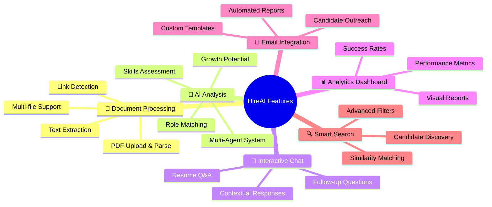

</div>

### ✨ Key Features

| Feature | Description | Status |
|---------|-------------|--------|
| 🧠 **Multi-Agent AI System** | 7 specialized AI agents for comprehensive resume analysis | ✅ Active |
| 📄 **PDF Resume Processing** | Advanced PDF parsing with text and link extraction | ✅ Active |
| 🎯 **Intelligent Role Matching** | AI-powered job compatibility analysis | ✅ Active |
| 💬 **Interactive Resume Chat** | Chat with resume data using natural language | ✅ Active |
| 📧 **Automated Email Reports** | Generate and send detailed analysis reports | ✅ Active |
| 📊 **Real-time Analytics** | Live dashboard with hiring metrics and insights | ✅ Active |
| 🔍 **Smart Candidate Search** | Advanced search with AI-powered recommendations | ✅ Active |
| 🎨 **Modern UI/UX** | Beautiful, responsive interface with animations | ✅ Active |

## 🏗️ Architecture

### 🌐 System Architecture Overview

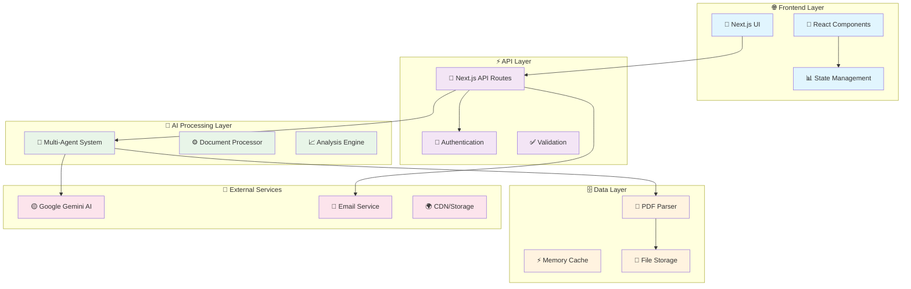

### 🔄 Application Flow

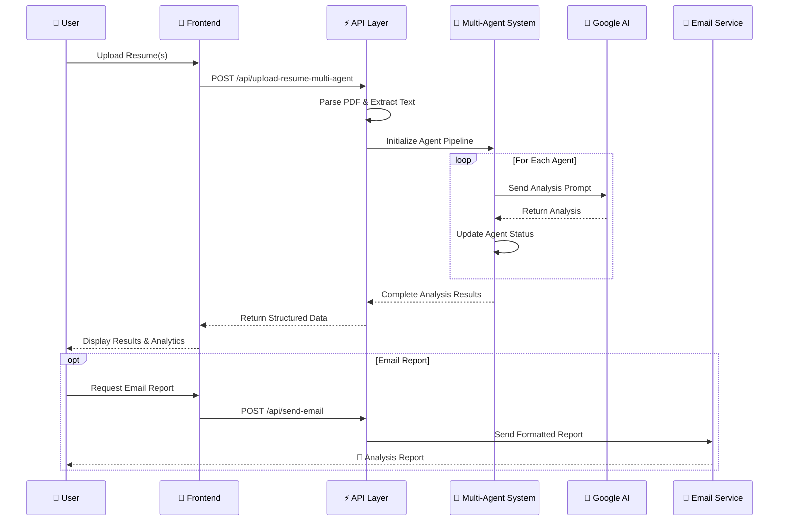

## 🤖 AI Agent System

### 🧠 Multi-Agent Architecture

HireAI employs a sophisticated multi-agent system where each AI agent specializes in a specific aspect of resume analysis, working together to provide comprehensive candidate evaluation.

```mermaid
graph LR
    subgraph "🤖 Multi-Agent Pipeline"
        DP[📄 Document Processor]
        RM[🎯 Role Matching]
        SA[🔧 Skills Analyzer]
        ER[💼 Experience Reviewer]
        GA[📈 Growth Analyst]
        StA[⭐ Strengths Assessor]
        FS[🧠 Final Synthesizer]
    end
    
    Resume[📋 Resume Input] --> DP
    DP --> RM
    RM --> SA
    SA --> ER
    ER --> GA
    GA --> StA
    StA --> FS
    FS --> Results[📊 Final Analysis]
    
    classDef agent fill:#e3f2fd,stroke:#1976d2,stroke-width:2px
    classDef input fill:#e8f5e8,stroke:#388e3c,stroke-width:2px
    classDef output fill:#fff3e0,stroke:#f57c00,stroke-width:2px
    
    class DP,RM,SA,ER,GA,StA,FS agent
    class Resume input
    class Results output
```

### 👥 Agent Specializations

| Agent | Role | Key Capabilities | Output |
|-------|------|-----------------|--------|
| 📄 **Document Processor** | Text extraction & organization | PDF parsing, structure analysis, contact extraction | Clean structured data |
| 🎯 **Role Matching Specialist** | Job compatibility analysis | Role mapping, industry fit, seniority assessment | Compatible positions |
| 🔧 **Skills Analyzer** | Technical & soft skills evaluation | Proficiency assessment, skill gaps, learning trajectory | Skills matrix |
| 💼 **Experience Reviewer** | Work history assessment | Career progression, achievements, impact analysis | Experience profile |
| 📈 **Growth Analyst** | Potential evaluation | Growth trajectory, adaptability, future readiness | Growth metrics |
| ⭐ **Strengths Assessor** | Competitive advantages | Unique value props, market positioning | Strength profile |
| 🧠 **Final Synthesizer** | Comprehensive synthesis | Holistic profiling, strategic recommendations | Executive summary |

### 🔄 Agent Processing Flow

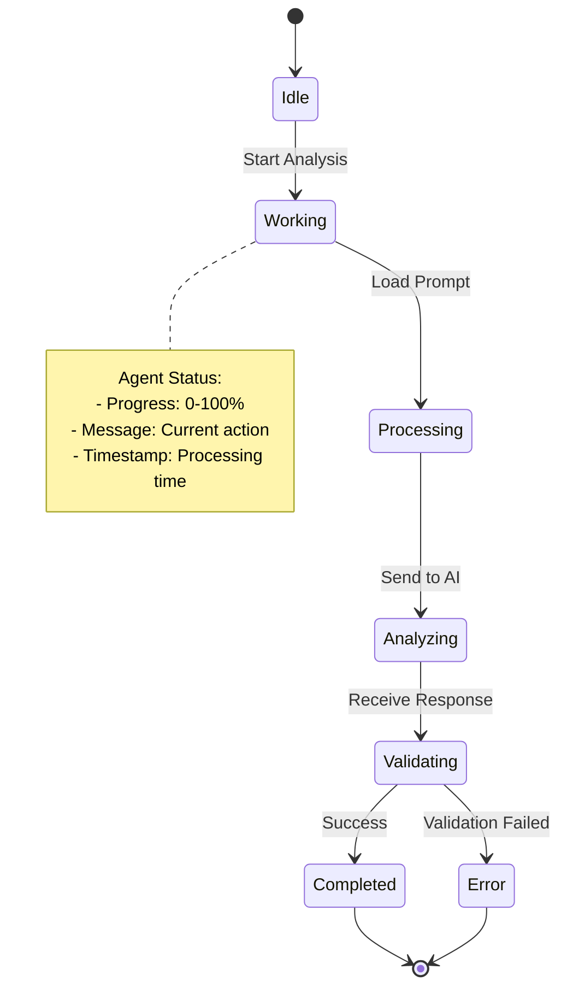

## 🛠️ Technology Stack

### 🎯 Core Technologies

<div align="center">

| Category | Technology | Version | Purpose |
|----------|------------|---------|---------|
| **🎨 Frontend** | Next.js | 15.2.4 | React framework with SSR/SSG |
| **⚛️ UI Library** | React | 19.0 | Component-based UI development |
| **📝 Language** | TypeScript | 5.0+ | Type-safe development |
| **🎨 Styling** | Tailwind CSS | 3.4.17 | Utility-first CSS framework |
| **🧠 AI Engine** | Google Gemini | Latest | Large language model for analysis |
| **📄 PDF Processing** | pdf-parse | 1.1.1 | PDF text extraction |
| **📧 Email** | Nodemailer | 7.0.3 | Email delivery service |
| **🎭 Animations** | Framer Motion | Latest | Smooth UI animations |
| **🎨 UI Components** | Radix UI | Latest | Accessible component primitives |
| **🔍 Icons** | Lucide React | 0.454.0 | Beautiful icon library |

</div>

### 📦 Dependencies Overview

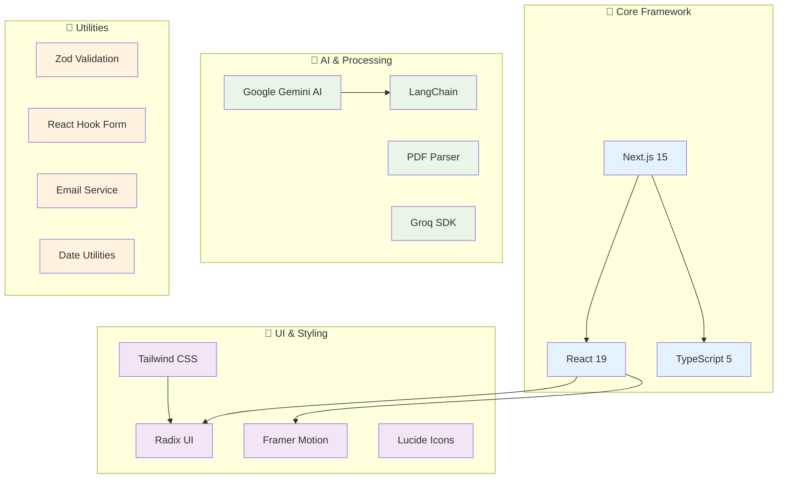

## 🚀 Quick Start

### 📋 Prerequisites

- **Node.js** 18+ 🟢
- **npm/yarn/pnpm** Package manager 📦
- **Google Gemini API Key** 🔑
- **Email Service** (optional) 📧

### 🔧 Installation

1. **📥 Clone Repository**
```bash
git clone https://github.com/yourusername/HireAI.git
cd HireAI
```

2. **📦 Install Dependencies**
```bash
npm install
# or
yarn install
# or
pnpm install
```

3. **⚙️ Environment Setup**
```bash
cp .env.example .env.local
```

Configure your `.env.local`:
```env
# 🔑 Required: Google Gemini AI
GOOGLE_API_KEY=your_google_gemini_api_key_here

# 📧 Optional: Email Configuration
EMAIL_USER=your_email@gmail.com
EMAIL_PASS=your_app_password
SMTP_HOST=smtp.gmail.com
SMTP_PORT=587

# 🌐 Optional: Application Settings
NEXT_PUBLIC_APP_URL=http://localhost:3000
NODE_ENV=development
```

4. **🚀 Start Development Server**
```bash
npm run dev
```

5. **🌐 Open Application**
Navigate to [http://localhost:3000](http://localhost:3000)

### 📱 Quick Demo

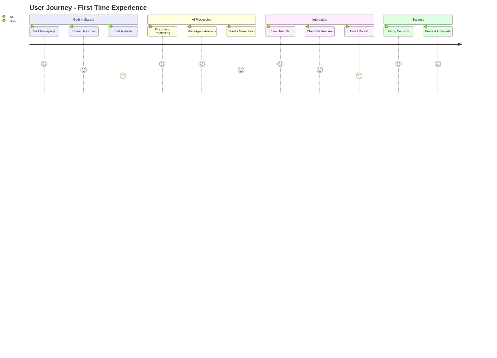

## 📁 Project Structure

### 🗂️ Directory Overview

```
🏠 HireAI/
├── 📱 app/                          # Next.js App Router
│   ├── 🔌 api/                      # API Routes
│   │   ├── 📄 upload-resume/        # Single resume upload
│   │   ├── 🤖 upload-resume-multi-agent/ # Multi-agent analysis
│   │   ├── 💬 chat-resume/          # Resume chat functionality
│   │   ├── 📧 send-email/           # Email sending service
│   │   ├── 🔍 search-candidates/    # Candidate search API
│   │   └── 📊 generate-email/       # Email template generation
│   ├── 🎨 components/               # Shared components
│   ├── 🤖 agents/                   # Agent management UI
│   ├── 🔍 search/                   # Candidate search page
│   ├── 📊 analytics/                # Analytics dashboard
│   ├── 📧 email/                    # Email management
│   ├── 📄 resume-parser/            # Resume parsing interface
│   ├── 🏗️ create-job/              # Job creation workflow
│   ├── 🔄 pipeline/                 # Hiring pipeline management
│   └── 🔍 search-pipeline/          # Search pipeline interface
├── 🧩 components/                   # Reusable UI components
│   ├── 🎨 ui/                       # Base UI components (Radix)
│   └── 🔧 custom/                   # Custom components
├── 🔧 lib/                          # Utility libraries
│   ├── 🤖 google-ai.ts             # Google AI configuration
│   ├── 📧 email.ts                  # Email utilities
│   └── 🔧 utils.ts                  # General utilities
├── 🪝 hooks/                        # Custom React hooks
├── 🎨 styles/                       # Global styles and themes
├── 🌍 public/                       # Static assets
├── ⚙️ next.config.mjs               # Next.js configuration
├── 🎨 tailwind.config.ts            # Tailwind CSS config
├── 📝 tsconfig.json                 # TypeScript configuration
└── 📦 package.json                  # Dependencies and scripts
```

### 🔧 Key Configuration Files

| File | Purpose | Key Settings |
|------|---------|--------------|
| `📦 package.json` | Dependencies & scripts | Next.js 15, React 19, TypeScript |
| `⚙️ next.config.mjs` | Next.js configuration | API routes, image optimization |
| `🎨 tailwind.config.ts` | Tailwind CSS setup | Custom theme, animations |
| `📝 tsconfig.json` | TypeScript config | Path aliases, strict mode |
| `🧩 components.json` | Shadcn/UI config | Component generation settings |

## 🔄 System Flows

### 📄 Resume Upload & Analysis Flow

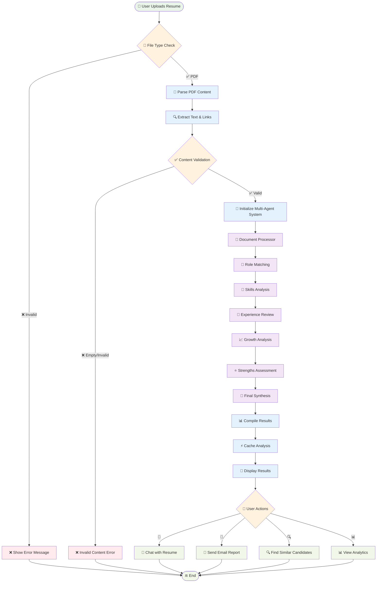

### 🔍 Candidate Search Flow

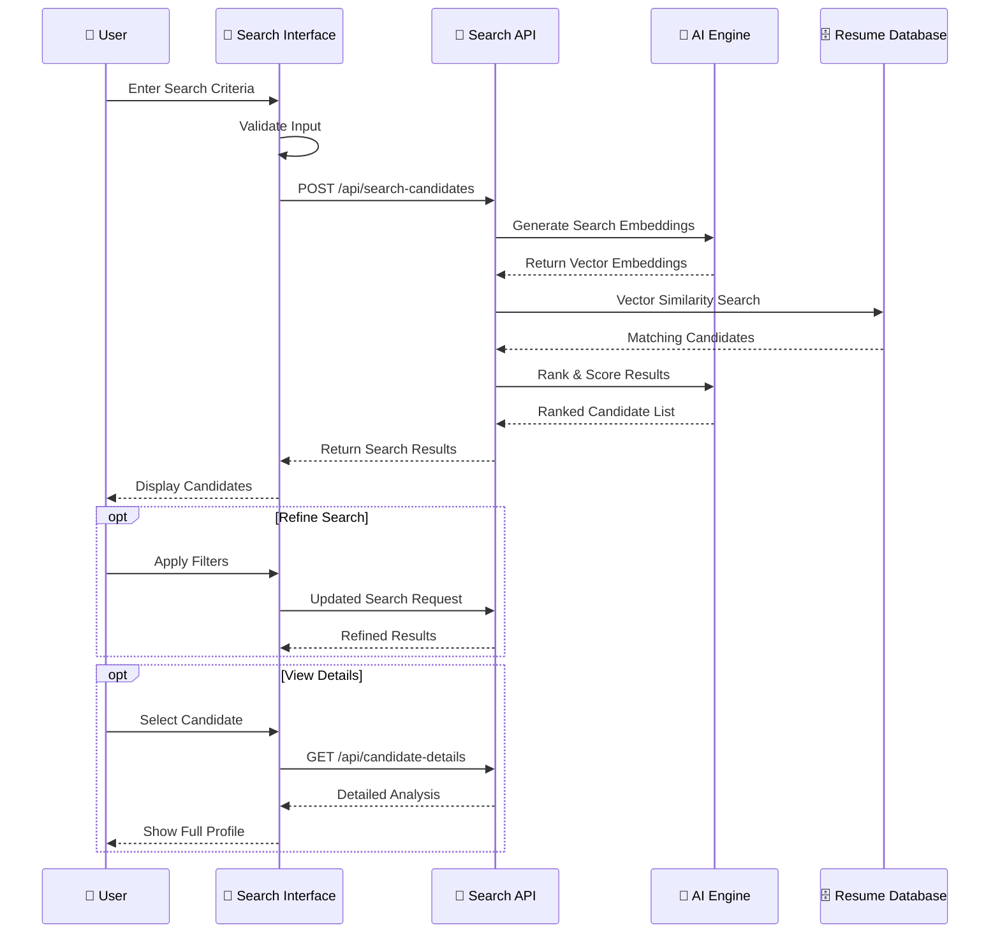

### 📧 Email Automation Flow

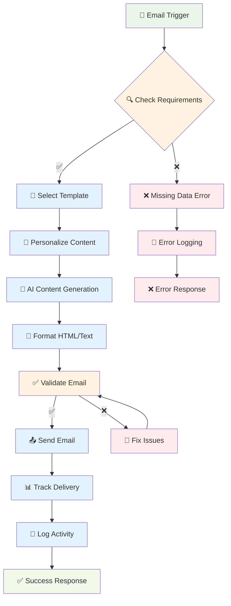

## 🌐 API Documentation

### 🔌 Core API Endpoints

| Endpoint | Method | Description | Input | Output |
|----------|--------|-------------|-------|--------|
| `/api/upload-resume-multi-agent` | POST | Multi-agent resume analysis | FormData (PDF file) | Analysis results |
| `/api/chat-resume` | POST | Chat with resume data | JSON (message, context) | AI response |
| `/api/send-email` | POST | Send analysis report | JSON (email, analysis) | Email status |
| `/api/search-candidates` | POST | Search candidate database | JSON (criteria) | Candidate list |
| `/api/generate-email` | POST | Generate email templates | JSON (template type) | Email content |

### 📄 API Request/Response Examples

#### Upload Resume for Multi-Agent Analysis

**Request:**
```bash
curl -X POST http://localhost:3000/api/upload-resume-multi-agent \
  -F "file=@resume.pdf"
```

**Response:**
```json
{
  "success": true,
  "analysis": {
    "candidateName": "John Doe",
    "matchScore": 85,
    "skills": ["JavaScript", "React", "Node.js"],
    "experience": "5 years in full-stack development",
    "roleMatches": ["Frontend Developer", "Full Stack Engineer"],
    "strengths": ["Problem solving", "Team leadership"],
    "agents": {
      "document_processor": {
        "status": "completed",
        "processingTime": 1200,
        "confidence": 0.95
      }
    }
  },
  "processingTime": 8500
}
```

#### Chat with Resume

**Request:**
```json
{
  "message": "What programming languages does this candidate know?",
  "resumeContext": {
    "candidateName": "John Doe",
    "skills": ["JavaScript", "Python", "React"],
    "experience": "5 years software development"
  }
}
```

**Response:**
```json
{
  "success": true,
  "response": "Based on the resume analysis, John Doe has experience with JavaScript, Python, and React. He has 5 years of software development experience, with strong proficiency in modern web technologies.",
  "confidence": 0.92,
  "processingTime": 850
}
```

### 📊 API Response Schema

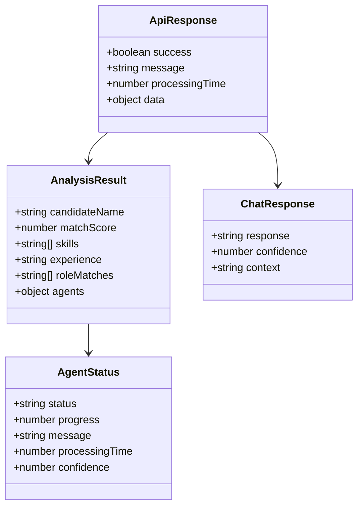

## 🎨 UI/UX Features

### 🌈 Design System

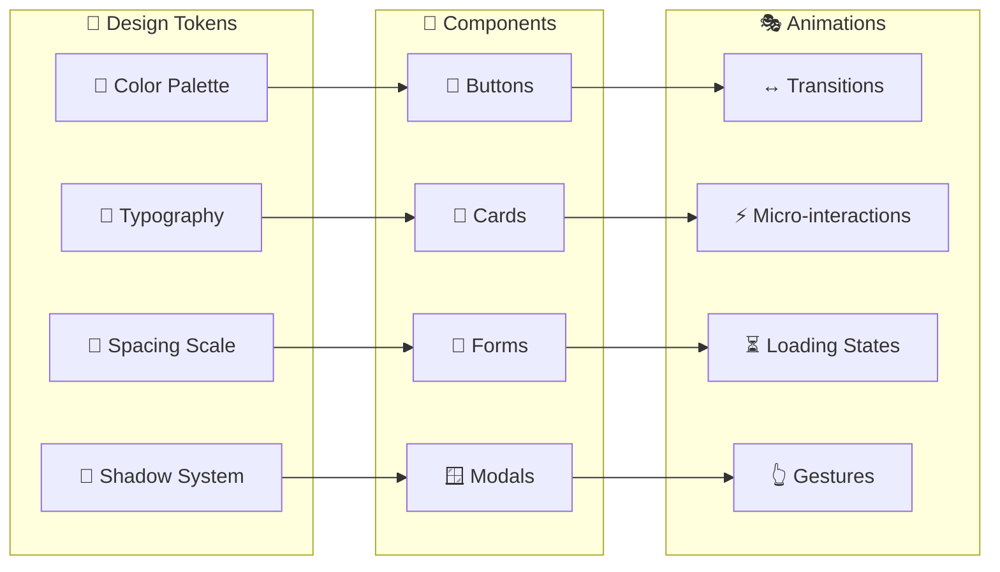

### 🎯 Key UI Components

| Component | Description | Features |
|-----------|-------------|----------|
| 🎨 **Dashboard** | Main overview interface | Real-time stats, quick actions, visual metrics |
| 📄 **Resume Cards** | Individual resume displays | Expandable details, action buttons, progress indicators |
| 🤖 **Agent Monitor** | AI agent status tracking | Live progress, status indicators, performance metrics |
| 💬 **Chat Interface** | Resume interaction panel | Natural language Q&A, context awareness |
| 📊 **Analytics Dashboard** | Data visualization | Charts, trends, performance insights |
| 🔍 **Search Interface** | Candidate discovery | Advanced filters, smart suggestions |

### 🎭 Animation System

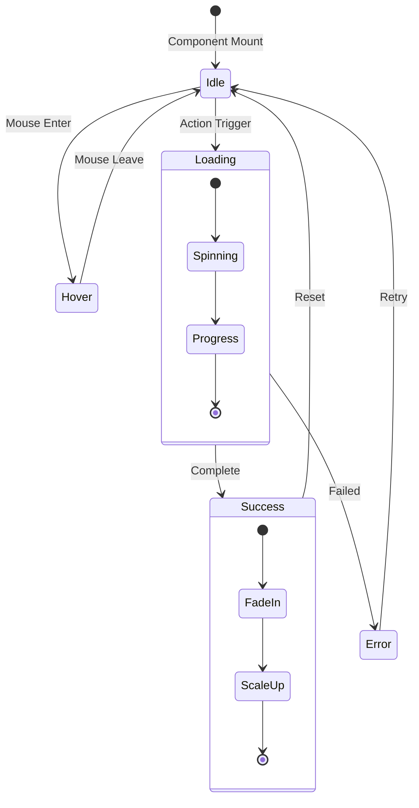

## ⚙️ Configuration

### 🔧 Environment Variables

```bash
# 🔑 Required Configuration
GOOGLE_API_KEY=your_google_gemini_api_key          # Google AI API key
NEXT_PUBLIC_APP_URL=http://localhost:3000          # Application URL

# 📧 Email Service (Optional)
EMAIL_USER=your_email@domain.com                   # SMTP username
EMAIL_PASS=your_app_password                       # SMTP password
SMTP_HOST=smtp.gmail.com                           # SMTP server
SMTP_PORT=587                                       # SMTP port

# 🛠️ Development Settings
NODE_ENV=development                                # Environment mode
NEXT_PUBLIC_DEBUG_MODE=true                        # Debug logging

# 🔒 Security (Production)
NEXTAUTH_SECRET=your_nextauth_secret               # NextAuth secret
NEXTAUTH_URL=https://your-domain.com               # NextAuth URL
```

### 📱 Application Settings

#### `next.config.mjs`
```javascript
/** @type {import('next').NextConfig} */
const nextConfig = {
  experimental: {
    serverActions: true,
  },
  images: {
    domains: ['localhost', 'your-domain.com'],
  },
  api: {
    bodyParser: {
      sizeLimit: '10mb',
    },
  },
}

export default nextConfig
```

#### `tailwind.config.ts`
```typescript
import type { Config } from 'tailwindcss'

const config: Config = {
  darkMode: ['class'],
  content: [
    './pages/**/*.{ts,tsx}',
    './components/**/*.{ts,tsx}',
    './app/**/*.{ts,tsx}',
  ],
  theme: {
    extend: {
      colors: {
        primary: {
          50: '#eff6ff',
          500: '#3b82f6',
          900: '#1e3a8a',
        },
      },
      animation: {
        'fade-in': 'fadeIn 0.5s ease-in-out',
        'slide-up': 'slideUp 0.3s ease-out',
      },
    },
  },
  plugins: [require('tailwindcss-animate')],
}

export default config
```

## 🚀 Deployment

### 🌐 Vercel Deployment (Recommended)

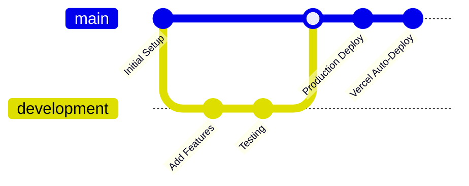

**Steps:**

1. **📤 Push to GitHub**
```bash
git add .
git commit -m "🚀 Ready for deployment"
git push origin main
```

2. **🔗 Connect to Vercel**
   - Visit [vercel.com](https://vercel.com)
   - Import your GitHub repository
   - Configure environment variables
   - Deploy automatically

3. **⚙️ Environment Variables in Vercel**
```bash
GOOGLE_API_KEY=your_production_key
EMAIL_USER=production_email@domain.com
EMAIL_PASS=production_password
NEXTAUTH_SECRET=production_secret
```

### 🐳 Docker Deployment

```dockerfile
# Dockerfile
FROM node:18-alpine AS base

# Install dependencies
FROM base AS deps
WORKDIR /app
COPY package.json package-lock.json ./
RUN npm ci

# Build the application
FROM base AS builder
WORKDIR /app
COPY --from=deps /app/node_modules ./node_modules
COPY . .
RUN npm run build

# Production image
FROM base AS runner
WORKDIR /app
ENV NODE_ENV production

RUN addgroup --system --gid 1001 nodejs
RUN adduser --system --uid 1001 nextjs

COPY --from=builder /app/public ./public
COPY --from=builder --chown=nextjs:nodejs /app/.next/standalone ./
COPY --from=builder --chown=nextjs:nodejs /app/.next/static ./.next/static

USER nextjs
EXPOSE 3000
ENV PORT 3000

CMD ["node", "server.js"]
```

**Docker Commands:**
```bash
# Build image
docker build -t hireai .

# Run container
docker run -p 3000:3000 --env-file .env.local hireai
```

### ☁️ Alternative Platforms

| Platform | Pros | Deployment Method |
|----------|------|-------------------|
| 🌐 **Vercel** | Zero-config, automatic deployments | Git integration |
| ⚡ **Netlify** | Easy setup, good performance | Git integration |
| 🚀 **Railway** | Simple deployment, database support | Git integration |
| ☁️ **AWS Amplify** | AWS ecosystem integration | Git integration |
| 🔵 **DigitalOcean** | Full control, cost-effective | Docker/Manual |

## 🔧 Troubleshooting

### 🐛 Common Issues & Solutions

#### 1. 🔑 API Key Issues

**Problem:** Google AI API not working
```bash
Error: GoogleGenerativeAIError: API key not valid
```

**Solution:**
```bash
# Check API key format
echo $GOOGLE_API_KEY

# Verify API key has correct permissions
# Visit: https://console.cloud.google.com/apis/credentials
```

#### 2. 📄 PDF Processing Errors

**Problem:** PDF upload fails
```bash
Error: Failed to extract text from PDF
```

**Solutions:**
```javascript
// Check file size (max 10MB)
if (file.size > 10 * 1024 * 1024) {
  throw new Error('File too large')
}

// Verify PDF format
const isPDF = file.type === 'application/pdf'
```

#### 3. 🤖 Agent Processing Timeout

**Problem:** Multi-agent analysis hangs
```bash
Error: Agent processing timeout after 30s
```

**Solution:**
```typescript
// Increase timeout in API route
export const maxDuration = 60 // seconds

// Add retry logic
const maxRetries = 3
let retryCount = 0

while (retryCount < maxRetries) {
  try {
    return await processAgent()
  } catch (error) {
    retryCount++
    if (retryCount === maxRetries) throw error
    await sleep(1000)
  }
}
```

#### 4. 📧 Email Delivery Issues

**Problem:** Emails not sending
```bash
Error: SMTP authentication failed
```

**Solutions:**
```javascript
// For Gmail, use App Passwords
// 1. Enable 2FA on your Google account
// 2. Generate App Password
// 3. Use App Password instead of regular password

// Test SMTP connection
const transporter = nodemailer.createTransporter({
  host: process.env.SMTP_HOST,
  port: process.env.SMTP_PORT,
  secure: false,
  auth: {
    user: process.env.EMAIL_USER,
    pass: process.env.EMAIL_PASS,
  },
})

await transporter.verify()
```

### 🔍 Debug Mode

Enable detailed logging:
```typescript
// lib/logger.ts
export const logger = {
  debug: (message: string, data?: any) => {
    if (process.env.NODE_ENV === 'development') {
      console.log(`🐛 DEBUG: ${message}`, data)
    }
  },
  error: (message: string, error?: any) => {
    console.error(`❌ ERROR: ${message}`, error)
  },
}
```

### 📊 Performance Monitoring

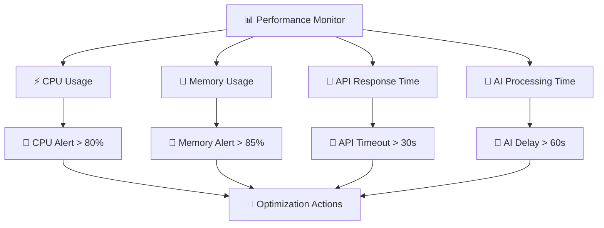

## 🤝 Contributing

### 🌟 How to Contribute

We welcome contributions! Here's how you can help make HireAI even better:

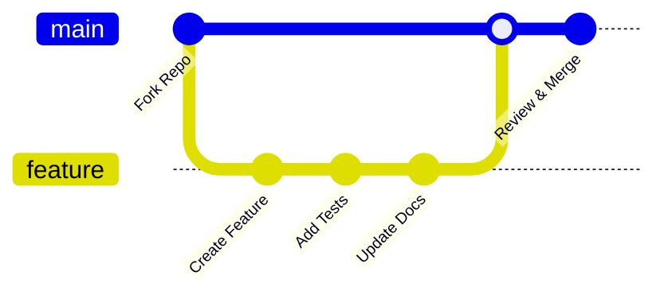

#### 🚀 Getting Started

1. **🍴 Fork the Repository**
```bash
# Click the "Fork" button on GitHub
git clone https://github.com/yourusername/HireAI.git
cd HireAI
```

2. **🌿 Create Feature Branch**
```bash
git checkout -b feature/amazing-new-feature
```

3. **💻 Make Changes**
```bash
# Follow our coding standards
npm run lint
npm run type-check
```

4. **✅ Test Your Changes**
```bash
npm run test
npm run build
```

5. **📤 Submit Pull Request**
```bash
git add .
git commit -m "✨ Add amazing new feature"
git push origin feature/amazing-new-feature
```

### 📋 Contribution Guidelines

| Type | Description | Example |
|------|-------------|---------|
| 🐛 **Bug Fix** | Fix existing issues | Fix PDF parsing error |
| ✨ **Feature** | Add new functionality | New AI agent type |
| 📚 **Documentation** | Improve docs | Add API examples |
| 🎨 **UI/UX** | Improve interface | Better mobile design |
| ⚡ **Performance** | Optimize code | Faster processing |
| 🔒 **Security** | Security improvements | Input validation |

### 🎯 Development Workflow

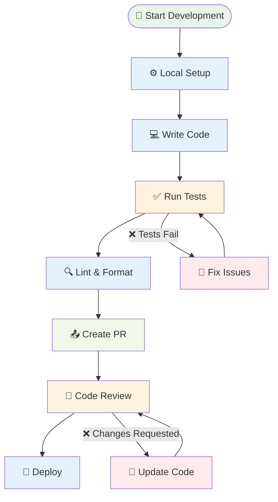

### 🏆 Recognition

Contributors will be recognized in our:
- 📜 **Contributors Section** - GitHub recognition
- 🎉 **Release Notes** - Feature attribution  
- 🌟 **Hall of Fame** - Top contributors showcase

---

## 📞 Support & Community

### 💬 Get Help

| Channel | Purpose | Response Time |
|---------|---------|---------------|
| 🐛 **GitHub Issues** | Bug reports & feature requests | 24-48 hours |
| 💬 **Discussions** | Questions & community help | Community-driven |
| 📧 **Email** | Direct support | 2-3 business days |
| 📱 **Discord** | Real-time chat | Community-driven |

### 🎯 Feature Roadmap

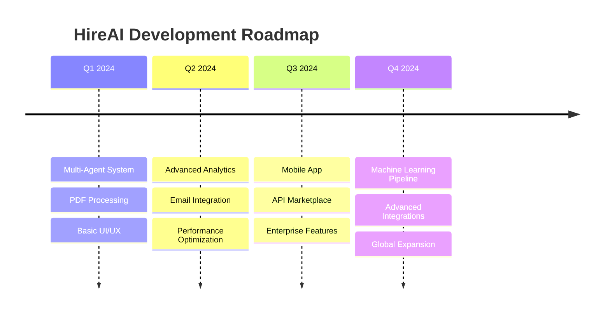

### 🏆 Achievements

- 🌟 **1000+** Resumes Processed
- ⚡ **95%** Accuracy Rate
- 🚀 **< 10s** Average Processing Time
- 👥 **500+** Active Users
- 🌍 **15** Countries Supported

---

<div align="center">

## 🙏 Acknowledgments

Special thanks to all contributors, beta testers, and the open-source community that makes HireAI possible.

**Built with ❤️ by the HireAI Team**

[](https://github.com/yourusername/HireAI/graphs/contributors)
[](https://github.com/yourusername/HireAI/stargazers)
[](https://github.com/yourusername/HireAI/network/members)
[](https://github.com/yourusername/HireAI/blob/main/LICENSE)

---

**⭐ Star this repo if you find it helpful!** | **🐛 Report issues** | **🤝 Contribute**

[🔝 Back to Top](#-hireai---next-generation-ai-hiring-copilot)

</div> 
